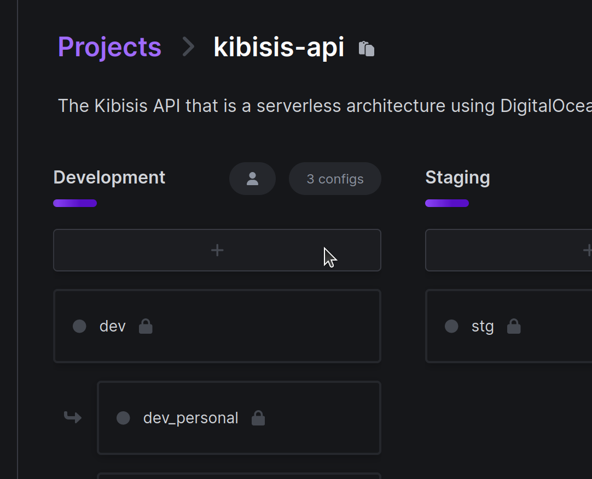

<p align="center">
  
</p>

<h1 align="center">
   Kibisis API
</h1>

<p align="center">
  The Kibisis API is a set of DigitalOcean functions that act as a RESTful API for the Kibisis ecosystem.
</p>

<p align="center">
  <a href="https://github.com/agoralabs-sh/kibisis-api/releases/latest">
    
  </a>
  <a href="https://github.com/agoralabs-sh/kibisis-api/releases/latest">
    
  </a>
</p>

<p align="center">
  <a href="https://github.com/agoralabs-sh/kibisis-api/releases">
    
  </a>
  <a href="https://github.com/agoralabs-sh/kibisis-api/releases">
    
  </a>
</p>

<p align="center">
  <a href="https://github.com/agoralabs-sh/kibisis-api/blob/main/COPYING">
    
  </a>
</p>

#### Table of contents

* [1. Overview](#-1-overview)
  - [1.1. Project structure](#11-project-structure)
* [2. Development](#-2-development)
  - [2.1. Requirements](#21-requirements)
  - [2.2. Create personal Doppler config](#22-create-personal-doppler-config)
  - [2.3. Setup `doppler`](#23-setup-doppler)
  - [2.4. Setup `doctl`](#24-setup-doctl)
  - [2.5. Create a personal namespace (optional)](#25-create-a-personal-namespace-optional)
  - [2.6. Deploy the functions to the namespace](#26-deploy-the-functions-to-the-namespace)
* [3. Appendix](#-3-appendix)
  - [3.1. Useful commands](#31-useful-commands)
* [4. How To Contribute](#-4-how-to-contribute)
* [5. License](#-5-license)

## 🗂️ 1. Overview

### 1.1. Project structure

The project structure borrows a lot from the project laid out by [https://github.com/golang-standards/project-layout](https://github.com/golang-standards/project-layout), with the exception of the `packages` and `lib` directories.

These directories are necessary due to the use of [DigitalOcean](https://docs.digitalocean.com/products/functions/how-to/structure-projects/)'s functions. See [below](#packages) for more details.

### `deployments`

This contains the Docker Compose configuration file(s). This is solely used for development purposes and is the orchestration for all the services in the `services/` directory.

### `lib`

This is a standalone module that is imported from the other packages or services and contains common code.

### `packages`

This is where each of functions resides. Each package corresponds to a version of the API and contains a list of functions, where each function relates to an API path.

For example, `v1/quests` will correspond to an API path `https://<endpoint>/v1/quests`.

> ⚠️ **NOTE:** Each path must parse the request header and handle the method, i.e. GET, POST, DELETE e.t.c.

### `services`

Each subdirectory is a service that follows the standard layout for a Go module:

* `services/<service>/cmd` - The main applications for the service resides in this directory where the directory name for each application should match the name of the executable you want to have (e.g., `/cmd/relay`).
* `services/<service>/internal` - Common application and library code for the service.

<sup>[Back to top ^][table-of-contents]</sup>

## 🛠️ 2. Development

### 2.1. Requirements

* [DigitalOcean CLI][doctl]
* [Docker Compose v2.5.0+][docker-compose]
* [Doppler CLI][doppler]
* [Golang v1.20+][golang]
* [Make][make]

<sup>[Back to top ^][table-of-contents]</sup>

## 2.2. Create personal Doppler config

To start using your own Doppler config, go to the project on [Doppler](https://dashboard.doppler.com/workplace/ae8c01548486ba93b8fd/projects/kibisis-api) and press the "+" to create a new personal branch config in the "Development" config

<p align="center">
  
</p>

> ⚠️ **NOTE:** Use your name in lowercase with hyphens instead of spaces (kebab-case).

<sup>[Back to top ^][table-of-contents]</sup>

### 2.3. Setup `doppler`

Once the branch project config has been setup, follow the instructions [here](https://docs.doppler.com/docs/install-cli#project-setup) to:
* login to Doppler, and;
* setup Doppler to use the `kibisis-api` project with your personal config.

> ⚠️ **NOTE:** When naming your token, it is recommended you use: "<your_name>-<device_name>".

<sup>[Back to top ^][table-of-contents]</sup>

### 2.4. Setup `doctl`

The DigitalOcean CLI client, `doctl`, is used to deploy the function to a remote environment that can be used to develop.

Follow the instructions outlined in the [documentation][doctl].

> ⚠️ **NOTE:** Once you have setup `doctl` make sure you also install the serverless subcommand using `doctl serverless install`

<sup>[Back to top ^][table-of-contents]</sup>

### 2.5. Create a personal namespace (optional)

> ⚠️ **NOTE:** If you have a personal namespace already setup, you can skip this step.

1. Setup a personal namespace using your name suffixed by the word "`namespace`" ensuring to use kebab-case:

```shell script
doctl serverless namespaces create --label="kieran-namespace" --region="ams3"
```

> ⚠️ **NOTE:** The above example shows setting up a namespace in the Amsterdam region, but it is better if you use a region that is closest to you. Run the command: `doctl serverless namespaces list-regions` to get a list of regions and replace the `--region` value with the desired region form the list.

<sup>[Back to top ^][table-of-contents]</sup>

### 2.6. Deploy the functions to the namespace

1. Deploy the function to the namespace that was created in the [previous](#25-create-a-personal-namespace-optional) step:
```shell
make deploy
```

2. Get the URL of the deployed function:
```shell
doctl serverless functions get <package>/<function> --url
```

This will return a URL in the form of:

```text
https://faas-ams3-2a2df116.doserverless.co/api/v1/web/<namespace>/<package>/<function>
```

Use this URL to interact with the API.

<sup>[Back to top ^][table-of-contents]</sup>

## 📑 3. Appendix

### 3.1. Useful commands

| Command        | Description                                                                                                                             |
|----------------|-----------------------------------------------------------------------------------------------------------------------------------------|
| `make`         | Deploys the functions to the remote namespace. Intended for development purposes only.                                                  |
| `make clean`   | Removes build files and configurations.                                                                                                 |
| `make deploy`  | Fetches secrets from Doppler and deploys the functions to the configured namespace. Intended for development purposes only.             |
| `make list`    | Lists the deployed functions in the configured namespace.                                                                               |
| `make logs`    | Outputs the activation logs for the deployed functions.                                                                                 |
| `make test`    | Runs the tests for each function.                                                                                                       |
| `make setup`   | Installs dependencies.                                                                                                                  |
| `make swagger` | Parses the functions and creates the swagger.json to `packages/vX/swagger` directories.                                                 |
| `make watch`   | Fetches secrets from Doppler and watches for code changes and redeploys functions to namespace. Intended for development purposes only. |

<sup>[Back to top ^][table-of-contents]</sup>

## 👏 4. How To Contribute

Please read the [**Contributing Guide**][contribute] to learn about the development process.

<sup>[Back to top ^][table-of-contents]</sup>

## 📄 5. License

Please refer to the [COPYING][copying] file.

<sup>[Back to top ^][table-of-contents]</sup>

<!-- Links -->
[contribute]: ./CONTRIBUTING.md
[copying]: ./COPYING
[docker-compose]: https://docs.docker.com/compose/install/
[doctl]: https://docs.digitalocean.com/reference/doctl/how-to/install/
[doppler]: https://docs.doppler.com/docs/install-cli
[golang]: https://go.dev/doc/install
[make]: https://www.gnu.org/software/make/
[table-of-contents]: #table-of-contents
